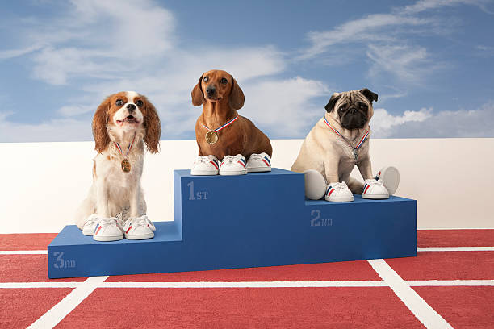

# Load Libraries

```{r, message=FALSE, warning=FALSE}
library(tidyverse)
library(here)
library(usmap)
library(reshape2)
library(kableExtra)
library(webshot)
```

---

# Introduction to the Data Set

- The data was received from the Tidy Tuesday Repository

--

- The data frame includes cat and dog population and ownership data from the United States.

--

- It was uploaded to the Tidy Tuesday Repository in 2018, but was originally uploaded on data.world in 2016.

--

- The data was collected from the American Veterinary Medical Association (AVMA).

```{r, message=FALSE, warning=FALSE}
CatvDog_Data <- read_csv(here("Data", "cats_vs_dogs.csv"))
```
---

# Cat Owner Percentage in the U.S.

- This plot illustrates the percentage of cat owners in the United States.

--

- This plot only contains data for the continental states due to lacking data for Alaska and Hawaii.

--
.pull-left[
```{r CatPercentPlot, eval= FALSE, message=FALSE}
plot_usmap(data = CatvDog_Data,   # Plots a flat map of the US.        
           values = "percent_cat_owners",  # Uses the data set and plots the percentage data.
           regions = "states",
           exclude = c("AK", "HI"),    # Excluding Alaska and Hawaii from the map since there is no data for them   
           color = "black")+
  labs(title = "Cat Owners of the United States",        # Adds titles to the plot. 
       subtitle = "Percentage of Cat Owners by State")+
  theme(panel.background = element_blank(),    # Makes the map blank inside and put the legend to the right.         
        legend.position = "right")+
  scale_fill_continuous(low = "white", high = "blue", name = "Percentage of Cat Owners")  # Gives a gradient effect in order of how high or low the percentage is.
```
]
```{r echo=FALSE, message=FALSE, warning=FALSE}
#ggsave(here("Output", "CatPercentPlot.jpg"),   # Saves the Plot
       #width = 8, height = 8)
```

.pull-right[
```{r CatPercentPlot-out, ref.label="CatPercentPlot", echo=FALSE, message=FALSE, warning=FALSE}
```
]

---

# Dog Owner Percentage in the U.S.

- This plot illustrates the percentage of dog owners in the United States.

--

- Like the plot before, this plot only contains data for the continental states due to lacking data for Alaska and Hawaii.

--

.pull-left[
```{r DogPercentPlot, eval= FALSE, message=FALSE}
plot_usmap(data = CatvDog_Data,           # Plots a flat map of the US.
           values = "percent_dog_owners",  # Uses the data set and plots the percentage data.
           regions = "states",
           exclude = c("AK", "HI"),       # Excluding Alaska and Hawaii from the map since there is no data for them.
           color = "black")+
  labs(title = "Dog Owners of the United States",         # Adds titles to the plot.
       subtitle = "Percentage of Dog Owners by State")+
  theme(panel.background = element_blank(),             # Makes the map blank inside and put the legend to the right.
        legend.position = "right")+
  scale_fill_continuous(low = "white", high = "red", name = "Percentage of Dog Owners")   # Gives a gradient effect in order of how high or low the percentage is.
```

]
.pull.right[
```{r DogPercentPlot-out, ref.label="DogPercentPlot", echo=FALSE, message=FALSE, warning=FALSE}
```
]


```{r echo=FALSE, message=FALSE, warning=FALSE}
#ggsave(here("Output", "DogPercentPlot.jpg"), # Saves the plot
       #width = 8, height = 8)
```

---

# Dog vs. Cat Households by State

- This next plot is a diverging bar plot that compares the number of dog and cat households per state.

--

- I mutated the data frame to subtract the number of dog households from the number of cat households.

--

- The diverging plot shows whether the state has more dog or cat households.

--

  - Dog households are colored red while cat households are colored blue.

```{r}
CatvDog_Data_Bar <- CatvDog_Data %>%
  mutate(value = n_dog_households - n_cat_households)  # Subtracts the number of dog households from the number of cat households for all of the states. Places them ina new column named 'Value'

color <- ifelse(CatvDog_Data_Bar$value < 0, "red", "blue")  # Assigns the volor blue to values less than zero and assigns red to those above 0.
```

---

# Dog vs. Cat Households by State

.pull-left[
```{r CatvDogBar, eval=FALSE, message=FALSE}
CatvDog_Data_Bar %>%     
  ggplot(aes(x = reorder(state, value), # Reorders the plot from most to least value
             y = value))+
  geom_bar(aes(fill = color), stat = "identity")+  # Fills the plot with the colors from the ifelse statement
  coord_flip()+   # Flips the coordinate plane
  labs(x = "State",   # Gives pretty labels to the plot
       y = "Number of Households",
       fill = "Type of Household",
       title = "Cats vs. Dogs in the U.S.",
       subtitle = "Categorized per State")+  
  theme_minimal()+  # Minimal theme.
  scale_fill_discrete(labels = c("Dog", "Cat"))+  # Re-labels the legend with prettier names (ex: instead of 'blue' and 'red')
  theme(plot.title = element_text(size = 16,     # Changes the size, color, face, and adjusts the title and subtitle.
                                  color = "black",
                                  face = 'bold',
                                  hjust = 0.5),
        plot.subtitle = element_text(size = 14,
                                     color = "black",
                                     face = 'italic',
                                     hjust = 0.5),
        axis.title = element_text(size = 12,      # Changes the size and color of the axis and legend titles.
                                  color = "black"),
        legend.title = element_text(size = 12,
                                    color = "black"))
```
]

.pull-right[
```{r CatvDogBar-out, ref.label="CatvDogBar", echo=FALSE, message=FALSE, warning=FALSE}
```
]

```{r echo=FALSE, warning=FALSE, message=FALSE}
#ggsave(here("Output", "CatvDogBar.jpg"),  # Saves the plot
       #width = 9, height = 9)
```

---

# Dog vs. Cat Households by State

- From the plot, it appears that more states have more households with dogs compared to cats.

--

  - Except for a few states: 

--

  - Massachusetts
    
--

  - Washington
  
--

  - and some other states
  
--

.center[]
---

# More State Comparisons for Dogs vs. Cats

- I decided to compare the three most populous states (California, Texas, and Florida) to the three least populous states (Wyoming, Vermont, and North Dakota).

--

- I compared the populations, number of households, and the average number within the households of both cats and dogs.

```{r, message=FALSE, warning=FALSE}
CatvDog_Stats <- CatvDog_Data %>%
  filter(state %in% c("California", "Texas", "Florida", "Wyoming", "Vermont", "North Dakota")) %>% # Filters the data by the states chosen. 
  select(state, n_cat_households, n_dog_households, cat_population, dog_population, avg_cats_per_household, avg_dogs_per_household) # Allows me to select the specific columns that I want to show in the data.
```

---
# More State Comparisons for Dogs vs. Cats

```{r}
knitr::kable(CatvDog_Stats, format = 'html',
             col.names = c("State", "Number of Cat Households", "Number of Dog Households", "Cat Population", "Dog Population", "Average Cats per Household", "Average Dogs per Household")) %>% # Gives nicer column names to the table.
  kable_styling(position = "left", full_width = FALSE) %>%  # Positions the table to the left and makes it so it is not full width.
  column_spec(1, bold = TRUE, border_right = TRUE, color = "black", background = "lightgrey") %>% # Bolds the column titles and makes them black. Makes the background of the column a light grey.
  row_spec(0, background  = "turquoise") #%>% # Colors the first row of the table with all of the titles turquoise
  #save_kable(file = "CatvDogTable.jpg")  # Saves the table as a .jpg file using webshot.
```

---
# More States Comparisons for Cats vs. Dogs

- As expected, states with larger populations have larger cat and dog populations as well as number of households.

--

- However, the average amount of cats and dogs per household is fairly consistent in each state despite the difference in population size within the states.


---
# Cat vs. Dogs

- Which do you prefer?

--

.pull-left[
Cats? 
  
  ]
  
--

.pull-right[
Dogs? 

]
  
--

.center[
Both? 
 
 ]
  

